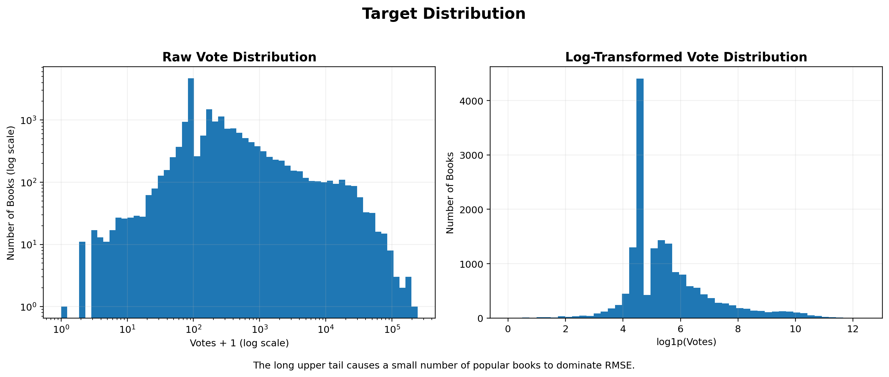
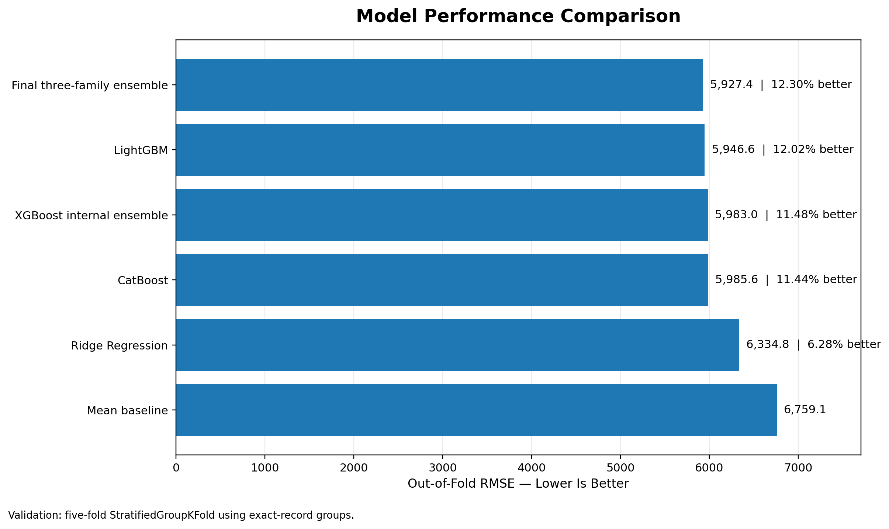
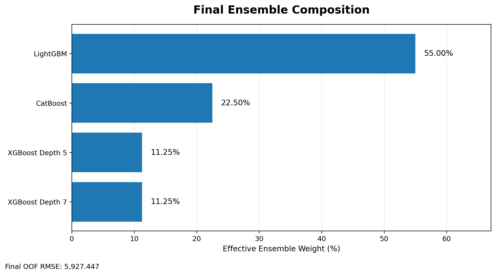
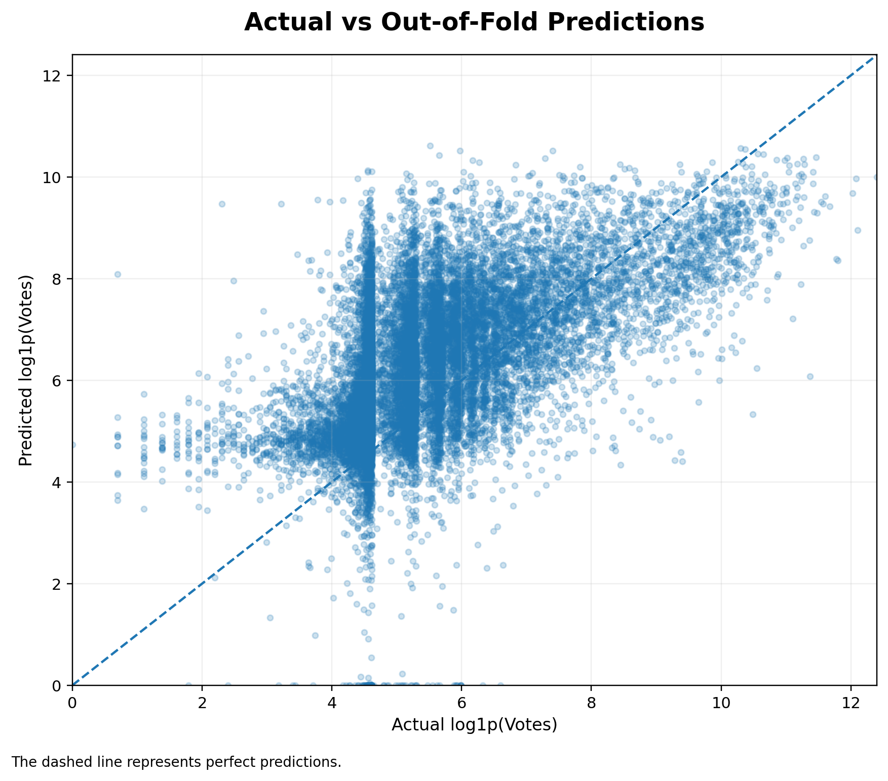

# Book Popularity Prediction Ensemble

A machine learning project for predicting book popularity from book and author metadata.

## Project Overview

This project was originally developed for a Kaggle classroom challenge in the **Supervised Machine Learning** course, created by my lecturer.

The objective was to predict the number of book votes using information such as ratings, genres, publication details, page count, series status, author book count, and author followers.

The evaluation metric is **Root Mean Squared Error (RMSE)**, where a lower score indicates better predictive performance.

## Dataset

The modeling data contains:

- **17,290 training observations**
- **11,527 test observations**
- 8 original predictor columns
- `votes` as the regression target

The target distribution is strongly right-skewed. A small number of highly popular books have substantially larger vote counts and dominate the RMSE metric.



## Data Challenges

The raw dataset contained several data-quality issues:

- page counts stored as text;
- publication types shifted into the page column;
- abbreviated numerical values such as `33.2k`;
- author follower values stored as `book` and `bookN`;
- missing genre, page, and publication information;
- rare and test-only categories;
- duplicate feature identities with different target values;
- exact feature overlap between train and test.

The preprocessing pipeline resolves these issues without manually modifying individual rows.

## Methodology

The final workflow includes:

1. data validation and anomaly detection;
2. parsing and cleaning mixed-format numerical columns;
3. date and publication feature extraction;
4. hierarchical page-count imputation;
5. rare-category grouping;
6. multi-label genre encoding;
7. numerical transformations;
8. leakage-aware grouped cross-validation;
9. linear and gradient-boosting model comparison;
10. heterogeneous model ensembling.

The final feature matrix contains:

- 27 numerical features;
- 90 one-hot categorical features;
- 311 multi-label genre features;
- **428 total model features**.

## Validation Strategy

Exact feature identities were grouped before cross-validation.

A five-fold `StratifiedGroupKFold` strategy was used to:

- prevent identical records from appearing in both training and validation folds;
- balance the highly skewed target distribution;
- provide consistent out-of-fold predictions for model comparison and ensembling.

## Model Performance

| Model | OOF RMSE |
|---|---:|
| Mean baseline | 6,759.068 |
| Ridge Regression | 6,334.786 |
| XGBoost internal ensemble | 5,982.997 |
| CatBoost | 5,985.573 |
| LightGBM | 5,946.640 |
| **Final ensemble** | **5,927.447** |

The final ensemble improves the mean baseline by approximately **12.30%**.



## Final Ensemble

The final prediction combines four gradient-boosting models:

| Model | Effective Weight |
|---|---:|
| LightGBM | 55.00% |
| CatBoost | 22.50% |
| XGBoost Depth 5 | 11.25% |
| XGBoost Depth 7 | 11.25% |



The models use complementary learning strategies:

- LightGBM uses leaf-wise tree growth;
- CatBoost processes selected categorical features natively;
- XGBoost contributes two different tree-capacity configurations.

## Out-of-Fold Prediction Analysis

Out-of-fold predictions show that the ensemble captures the general popularity pattern but still underpredicts several extreme high-vote observations.



The high-vote tail remains the main source of squared error because important popularity drivers may not be fully represented in the available metadata.

## Repository Structure

```text
book-popularity-prediction-ensemble/
├── assets/
│   ├── actual_vs_oof_predictions.png
│   ├── final_ensemble.png
│   ├── model_performance.png
│   └── target_distribution.png
├── data/
│   └── raw/
├── notebooks/
│   └── book-popularity-prediction-ensemble.ipynb
├── outputs/
│   ├── oof_predictions.csv
│   ├── submission_final_ensemble.csv
│   └── test_prediction_components.csv
├── README.md
└── requirements.txt
```

## Reproducing the Project

Clone the repository:

```bash
git clone https://github.com/widiearry/book-popularity-prediction-ensemble.git
cd book-popularity-prediction-ensemble
```

Create and activate a virtual environment:

```bash
python -m venv .venv
```

Windows:

```bash
.venv\Scripts\activate
```

macOS or Linux:

```bash
source .venv/bin/activate
```

Install the dependencies:

```bash
pip install -r requirements.txt
```

Open the notebook:

```bash
jupyter lab notebooks/book-popularity-prediction-ensemble.ipynb
```

Run all cells sequentially to reproduce the preprocessing, validation, modeling, ensemble, submission, and portfolio visualizations.

## Output Files

- `submission_final_ensemble.csv` — final test prediction
- `oof_predictions.csv` — out-of-fold predictions and residuals
- `test_prediction_components.csv` — prediction from each ensemble component

## Author

Built by [Ni Putu Widya Antary](https://github.com/widiearry).
